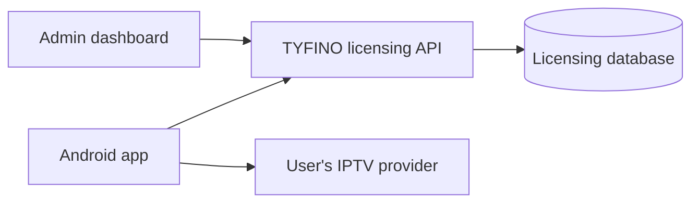

# TYFINO Project Architecture & Structure v3.1

Status: **APPROVED ARCHITECTURE BASELINE — IMPLEMENTATION IN PROGRESS**

Approved: 2026-09-19

Scope: repository structure, system boundaries, technology choices, runtime ownership, and release gates

## 1. Authority

This document is the approved general architecture baseline. More specific approved contracts under `docs/` override it only within their declared scope.

When instructions conflict, use this order:

1. current explicit user instruction;
2. approved scoped contract;
3. this architecture baseline and `docs/data-ownership.md`;
4. `AGENTS.md`;
5. component documentation;
6. current implementation;
7. older conversation or planning context.

Do not silently rewrite working code to match an obsolete proposed layout. Report a disagreement between an approved document and implementation before changing production behavior.

## 2. Product boundary

TYFINO is a native Android IPTV player with a separate application-licensing service and administration dashboard.

The following are **DECIDED**:

- Users bring their own IPTV subscription.
- `APPLICATION LICENSE != IPTV SUBSCRIPTION`.
- Android communicates directly with the user's IPTV provider.
- TYFINO services manage application licensing only.
- TYFINO services must never receive, store, validate, proxy, or return IPTV Host, Username, Password, catalog, EPG, stream URL, or playback history.
- Android V1 supports Xtream Codes only. M3U, Stalker, and MAC Portal are deferred.



The licensing service is never in the IPTV media or provider-authentication path.

## 3. Repository and technology baseline

The existing monorepo layout is authoritative:

```text
apps/android/              Kotlin + Jetpack Compose Android client
apps/api/                  TypeScript + Fastify licensing API
apps/admin/                React + Vite administration UI
database/                  PostgreSQL fresh-install schema
docs/                      Approved contracts and operating guidance
infrastructure/            Deployment preparation
sites/                     Existing web assets
```

The following are **DECIDED**:

- Keep the current `apps/*` structure; do not reorganize it into proposed `android/` or `backend/` roots.
- PostgreSQL is the licensing database.
- Android uses Kotlin, Jetpack Compose, and AndroidX Media3/ExoPlayer.
- Android uses one `app` module and manual dependency composition in V1. Add modules or a DI framework only for a measured ownership or build-performance need.
- One Android codebase supports phone, tablet, foldable, Android TV, and Google TV.
- Presentation adapts to available size, posture, and input mode rather than device-name checks.
- Arabic RTL and TV D-pad behavior are first-class requirements.

## 4. Android runtime boundary

The following are **DECIDED**:

- At most one saved IPTV account is authoritative and active at a time; multiple accounts may be stored and explicitly switched.
- Account identity uses a stable internal Account ID, not Username.
- Credentials remain encrypted with Android Keystore-backed storage and are excluded from backup.
- User-entered HTTP provider access requires explicit risk confirmation. There is no automatic HTTPS downgrade or TLS bypass.
- Favorites, history, resume, cached catalog, Series, and EPG data are isolated by Account ID.
- Every asynchronous result validates account/installation identity, generation, and operation ownership before commit. Cancellation alone is insufficient.
- Startup is not blocked by full catalog sync, full EPG sync, artwork, player creation, or non-essential licensing refresh.
- Full catalog preload is forbidden. Search in V1 is limited to already-downloaded local catalog snapshots.
- EPG is requested on demand per channel and retained in a bounded cache. Playback works without EPG.
- Resume writes at bounded lifecycle checkpoints, not every playback second.

Provider-wide search and full EPG synchronization remain **DEFERRED** until a measured user need justifies their cost.

## 5. Licensing baseline

The detailed authority is `docs/licensing-trial-contract-v1.md` and `docs/api.md`. The following summary is **DECIDED**:

- A trial lasts seven days and begins only after an explicit accepted user request.
- Paid activation uses an Activation Code for one year or lifetime.
- Each code permits one active installation in V1.
- An authorized administrator can reset the active device binding; the reset revokes older sessions and is audited.
- Server time is authoritative.
- Active clients refresh after 12 hours and may use the last verified entitlement offline for at most 72 hours.
- Licensing transport is HTTPS only.
- Android installation identity is random and opaque; MAC address, IMEI, Android ID, advertising ID, and hardware fingerprint are not activation inputs.
- Activation Codes and licensing tokens are secret and must never appear in ordinary logs.

The one-device rule is fixed for V1. A configurable per-code device count is **DEFERRED** until its concurrency, reset, UI, and migration semantics have an approved contract.

Binding an application license to an IPTV provider Host is **NOT AUTHORIZED** in V1 because it would violate the rule that provider connection data never enters TYFINO licensing. Any future host-binding design requires an explicit privacy-preserving contract and migration plan.

## 6. Administration baseline

V1 administration covers:

- Dashboard;
- Activation Codes;
- App Settings;
- Audit Log.

Customer Name, Phone Number, External Reference, Admin Label, and Internal Note are optional administrative-only metadata. They must never be returned to Android.

Every administrative action is authenticated and authorized server-side. The dashboard must not manage IPTV subscriptions, provider accounts, credentials, packages, channels, streams, or reseller operations.

## 7. Performance baseline

The reference performance floor is a low-RAM Android TV device with 1–2 GB RAM, not a flagship phone.

The following are **DECIDED**:

- navigation and visible focus take priority over images and background work;
- network timeouts, retries, response sizes, caches, and database retention are bounded;
- player and large data sources are created only when needed and released by lifecycle rules;
- UI remains responsive with missing artwork, unavailable EPG, slow providers, and large catalogs;
- performance claims require measurements on the qualification matrix.

## 8. Release gates

Development may continue with provisional identity values, but no production APK/AAB may be released until all applicable gates are `PASS`:

1. **Release identity:** approved Application ID, app label, icon, Android TV banner, version policy, ABI policy, and update policy.
2. **Signing:** production signing key, controlled access, verified backup, and recovery procedure.
3. **Production origin:** approved HTTPS licensing domain and environment configuration.
4. **Operations:** health checks, secret management, PostgreSQL backup plus tested restore, log rotation, rate limiting, rollback procedure, and session revocation.
5. **Admin security:** OWNER TOTP and a database-enforced append-only SHA-256 audit chain are implemented; secure secret provisioning, external integrity anchoring/monitoring, and privileged-database controls must be qualified before internet-facing production use.
6. **Qualification:** physical phone and Android TV/Google TV testing, touch and D-pad, RTL/LTR, accessibility, media tracks/subtitles, low-memory behavior, and performance.

Certificate pinning, Kubernetes, analytics/CRM, and crash SDKs are not V1 release requirements. Correct HTTPS, bounded behavior, backups, and qualification come first.

## 9. Implementation state boundary

This baseline describes approved architecture, not a claim that every V1 feature is complete. Current component status belongs in component documentation and a repository-based gap audit.

Qualification outcomes use exactly `PASS`, `FAIL`, `BLOCKED`, or `SKIPPED`. `BLOCKED` is never reported as `PASS`.
