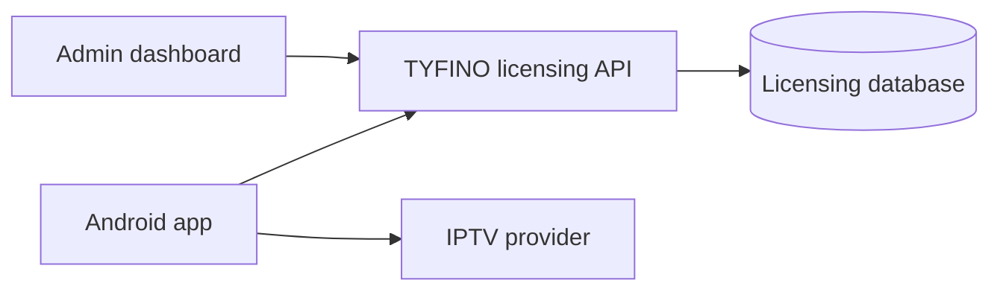

# TYFINO Architecture Boundary

Status: PROPOSED — awaiting approval  
Last reviewed: 2026-09-08

## System context

The following boundary is **DECIDED**:

IPTV media and provider authentication travel directly between the Android app and the user's IPTV provider. The licensing service is not in that path.

## Android client

The following are **DECIDED**:

- Native Android, Kotlin, and Jetpack Compose.
- One shared codebase for phones, tablets, foldables, Android TV, and Google TV.
- Adaptive presentation primarily follows available window space and interaction mode.
- TV is not a stretched phone interface.
- V1 provider protocol is Xtream Codes only.
- Users enter Host, Username, and Password in the Android client.
- Local-first account state is isolated by a stable internal Account ID.
- At most one IPTV account is authoritative and active at a time.
- Every asynchronous completion validates authoritative ownership at commit time; cancellation alone is insufficient.
- Startup is never blocked by full catalog sync, full EPG sync, artwork, player initialization, or licensing refresh.

The Android foundation remains intentionally small. Networking, persistence, dependency injection, player, and feature modules are added only when their approved scope requires them.

## Licensing service

The following are **DECIDED**:

- It manages TYFINO application trial and activation state only.
- A user may start a server-authoritative seven-day trial or activate immediately.
- Activation Code is the only V1 paid activation mechanism exposed to users.
- Administrator-configurable paid periods are one year and lifetime.
- It must not receive IPTV Host, Username, Password, catalog, stream, or playback history.
- It must not proxy IPTV requests or streams.

Exact anti-trial-abuse design, API endpoints, backend framework, hosting, and production deployment remain **OPEN** unless separately approved.

## Administration dashboard

The V1 dashboard scope is **PROPOSED** as Dashboard, Activation Codes, App Settings, and Audit Log.

Customer Name, Phone Number, External Reference, Admin Label, and Internal Note may exist as administrative-only activation metadata. They must not be sent to Android without a future explicit requirement.

IPTV subscriptions, provider accounts, credentials, packages, channels, streams, and reseller operations are outside the dashboard boundary.

## Account and async ownership

The detailed Android rules are defined by `docs/android/xtream-authentication-account-ownership-contract-v1.md` once approved.

Conceptually, correctness requires:

- stable account identity;
- account generation/version;
- operation identity where newer work supersedes older work;
- cancellation for efficiency;
- commit-time ownership validation for correctness.

The concrete implementation remains **OPEN** until the scoped contract is approved.

## Known legacy implementation mismatch

The current repository database and backend include provider hosts, provider accounts, IPTV credential fields, M3U/Stalker protocol values, and activation-to-provider-account relationships.

This is a confirmed mismatch with the approved boundary. The authoritative owner is the licensing backend/data model. Required remediation is **DEFERRED** to a dedicated audit and implementation task; these documentation changes do not delete or migrate data.

## Explicitly deferred contracts

- Player Contract.
- Catalog and EPG synchronization contract.
- TV screen focus contracts.
- Licensing and trial API contract.
- Release/signing contract.
- Full security and credential-storage implementation design.
