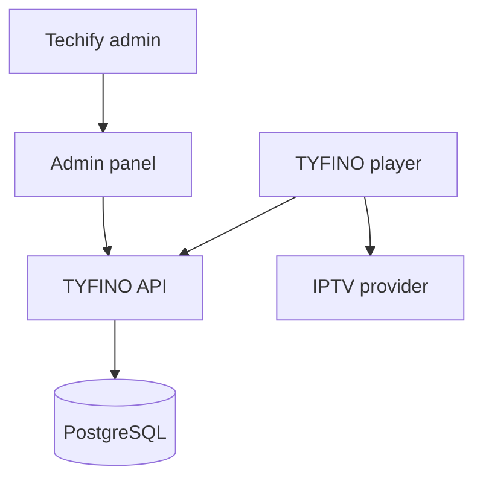

# Architecture

## System boundary

TYFINO is the control plane for the Techify player. It authenticates the app, enforces device limits, and returns the provider connection assigned by an administrator. It does not proxy, cache, or restream media.

## Activation flow

1. Techify creates or updates a customer manually.
2. Techify maps the customer's provider account to a provider host.
3. TYFINO generates a random activation code and stores only its hash.
4. The customer enters that code in the player.
5. The API validates status, expiration, and device limit.
6. The device receives only its assigned provider connection.
7. Playback traffic goes directly to the provider.

## Core modules

| Module | Responsibility |
| --- | --- |
| Identity | Admin login, sessions, roles, password reset, MFA later |
| Customers | Techify customer records and manual notes |
| Provider adapters | Xtream, M3U, and Stalker/MAC connection normalization |
| Activations | Code generation, hashing, expiry, revocation |
| Devices | Registration, limits, blocking, last-seen tracking |
| Audit | Immutable administrative activity trail |

## Provider integration rule

The current reseller panel has no API. Provider accounts are therefore entered manually. A future provider API must be integrated behind an adapter so the player and activation logic do not change.

## Platform strategy

- Shared product design and API contract for every platform.
- Flutter is the preferred player client for Android, Android TV, iOS, macOS, Windows, and web where supported.
- tvOS and platform-specific playback limitations will be validated before store release.
- The admin panel will be a responsive React/TypeScript web application.
